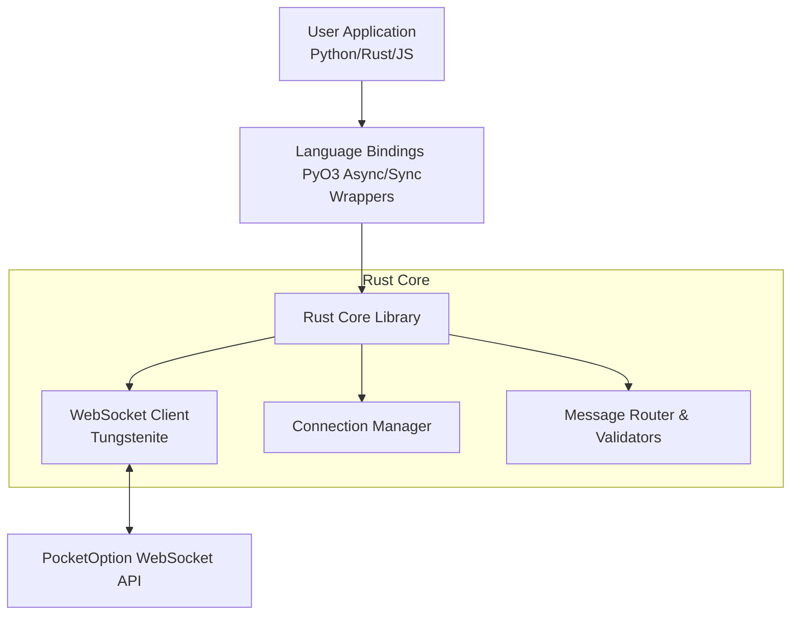

# BinaryOptionsTools V2

[](https://discord.com/invite/p7YyFqSmAz)
[](https://www.python.org/)
[](https://www.rust-lang.org/)
[](LICENSE)

**A high-performance, cross-platform package for automating binary options trading.**
Built with **Rust** for speed and memory safety, featuring **Python** bindings for ease of use.

---

## Support the Development

This project is maintained by the **ChipaDevTeam**. Your support helps keep the updates coming.

| Support Channel | Link |
| :--- | :--- |
| **PayPal** | [Support ChipaDevTeam](https://www.paypal.me/ChipaCL) |
| **PocketOption (Six)** | [Join via Six's Affiliate Link](https://poaffiliate.onelink.me/t5P7/9y34jkp3) |
| **PocketOption (Chipa)** | [Join via Chipa's Affiliate Link](https://u3.shortink.io/smart/SDIaxbeamcYYqB) |

---

## 📋 Table of Contents
- [Overview](#overview)
- [Features](#features)
- [Architecture](#architecture)
- [Installation](#installation)
- [Quick Start](#quick-start)
  - [Async API](#async-api-recommended)
  - [Sync API](#sync-api)
  - [Data Streaming](#real-time-data-streaming)
- [Advanced Usage](#advanced-usage)
- [Roadmap](#roadmap)
- [Legal & Disclaimer](#legal--disclaimer)

---

## Overview

**BinaryOptionsTools v2** is a complete rewrite of the original library. It bridges the gap between low-level performance and high-level usability.

### Key Highlights
*   **Rust Core**: Maximum performance, concurrency, and memory safety.
*   **Python Bindings**: seamless integration with the Python ecosystem via PyO3.
*   **WebSocket Native**: Real-time market data streaming and instant trade execution.
*   **Robust Connectivity**: Automatic reconnection, keep-alive monitoring, and error handling.
*   **Type Safety**: Strong typing across both Rust and Python interfaces.

### Supported Platforms
*   **PocketOption** (Quick Trading Mode & Pending Orders BETA)
    *   *Real & Demo Accounts Supported*

---

## Features

### Trading & Account
*   **Execution**: Place Buy/Sell orders instantly.
*   **Monitoring**: Check trade results (Win/Loss) with configurable timeouts.
*   **Balances**: Real-time account balance retrieval.
*   **Portfolio**: Access active positions and closed deal history.

### Market Data
*   **Live Stream**: Subscribe to real-time candles (tick, 5s, 15s, 30s, 60s, 300s).
*   **Historical**: Fetch OHLC data (`get_candles`) for backtesting.
*   **Payouts**: Retrieve current payout percentages for assets.
*   **Sync**: Server time synchronization for precision timing.

### Framework Utilities
*   **Raw Handler API**: Low-level WebSocket access for custom protocols.
*   **Validators**: Built-in message filtering system.
*   **Asset Logic**: Automatic verification of trading pairs and OTC availability.

---

## Architecture

The system uses a layered architecture to ensure stability and speed.



---

## Installation

### Python

#### Option A: Prebuilt Wheels (Recommended)
Install directly from our GitHub releases. Ensure you have **Python 3.8 - 3.12**.

**Windows**
```bash
pip install "https://github.com/ChipaDevTeam/BinaryOptionsTools-v2/releases/download/BinaryOptionsToolsV2-0.2.6/binaryoptionstoolsv2-0.2.6-cp38-abi3-win_amd64.whl"
```

**Linux**
```bash
pip install "https://github.com/ChipaDevTeam/BinaryOptionsTools-v2/releases/download/BinaryOptionsToolsV2-0.2.6/BinaryOptionsToolsV2-0.2.6-cp38-abi3-manylinux_2_34_x86_64.whl"
```

**macOS (Apple Silicon)**
```bash
pip install "https://github.com/ChipaDevTeam/BinaryOptionsTools-v2/releases/download/BinaryOptionsToolsV2-0.2.6/BinaryOptionsToolsV2-0.2.6-cp38-abi3-macosx_11_0_arm64.whl"
```

#### Option B: Build from Source
Requires `rustc`, `cargo`, and `maturin`.

```bash
git clone https://github.com/ChipaDevTeam/BinaryOptionsTools-v2.git
cd BinaryOptionsTools-v2/BinaryOptionsToolsV2
pip install maturin
maturin develop --release
```

#### Option B: Build from Source Automatically

```bash
pip install git+https://github.com/ChipaDevTeam/BinaryOptionsTools-v2.git#subdirectory=BinaryOptionsToolsV2
```

### Rust
Add this to your `Cargo.toml`:
```toml
[dependencies]
binary_options_tools = { path = "crates/binary_options_tools" }
```

---

## Quick Start

### Async API (Recommended)
Best for building trading bots that need to handle streams and trades simultaneously.

```python
import asyncio
import os
from BinaryOptionsToolsV2 import PocketOptionAsync

async def main():
    # 1. Get SSID (Session ID)
    ssid = os.getenv("POCKET_OPTION_SSID")
    
    # 2. Initialize with Context Manager
    async with PocketOptionAsync(ssid=ssid) as client:
        # Get Balance
        balance = await client.balance()
        print(f"Current Balance: ${balance}")

        # Place Trade: Asset, Amount, Duration
        trade_id, deal = await client.buy("EURUSD_otc", 1.0, 60)
        print(f"Trade Placed: {deal}")

        # Wait for Result
        result = await client.check_win(trade_id)
        print(f"Outcome: {result['result']}")

if __name__ == "__main__":
    asyncio.run(main())
```

### Sync API
Best for simple scripts or data fetching.

```python
from BinaryOptionsToolsV2 import PocketOption
import os

with PocketOption(ssid=os.getenv("POCKET_OPTION_SSID")) as client:
    print(f"Balance: ${client.balance()}")
    trade_id, _ = client.buy("EURUSD_otc", 1.0, 60)
    print(f"Result: {client.check_win(trade_id)['result']}")
```

### Real-time Data Streaming

```python
async with PocketOptionAsync(ssid="...") as client:
    # Subscribe to 1-minute candles
    subscription = await client.subscribe_symbol("EURUSD_otc", 60)

    print("Streaming data...")
    async for candle in subscription:
        print(f"Timestamp: {candle['time']} | Close: {candle['close']}")
```

---

## Advanced Usage

For complex implementations, you can access the **Raw Handler API**. This allows you to construct custom WebSocket messages and filter responses.

```python
# Create a validator to filter messages containing "balance"
validator = Validator.contains("balance")
handler = await client.create_raw_handler(validator)

# Send raw JSON request
await handler.send_text('42["getBalance"]')

# Listen to the filtered stream
async for message in await handler.subscribe():
    print(f"Raw Update: {message}")
```

> **Note on Authentication**: Authentication is handled via the `SSID` cookie. See our [Tutorials Directory](tutorials/) for instructions on how to extract this from your browser.

---

## Roadmap

- [x] **PocketOption**: Quick Trading
- [x] **PocketOption**: Pending Orders (BETA)
- [ ] **Platform**: Expert Options Integration
- [ ] **Platform**: IQ Option Integration
- [ ] **Core**: JavaScript/TypeScript Bindings
- [ ] **Core**: WebAssembly (WASM) Support
- [ ] **Tools**: Historical Data Export & Backtesting Framework

---

## Contributing

We welcome contributions!
1.  Fork the repo.
2.  Ensure tests pass (`cargo test` & `pytest`).
3.  Submit a Pull Request with clear descriptions.

---

## Legal & Disclaimer

### License
*   **Personal Use**: Free for personal, educational, and non-commercial use.
*   **Commercial Use**: Requires explicit written permission. Contact us on Discord.
*   See [LICENSE](LICENSE) for details.

### ⚠️ Risk Warning ⚠️
**This software is provided "AS IS" without warranty of any kind.**

*   Binary options trading involves high risk and may result in the loss of capital.
*   The authors and ChipaDevTeam are **NOT** responsible for any financial losses, trading errors, or software bugs.
*   Use this software entirely at your own risk.

***

[Documentation](https://chipadevteam.github.io/BinaryOptionsTools-v2/) | [API Reference](https://chipadevteam.github.io/BinaryOptionsTools-v2/API_REFERENCE/) | [Discord Community](https://discord.com/invite/p7YyFqSmAz)


