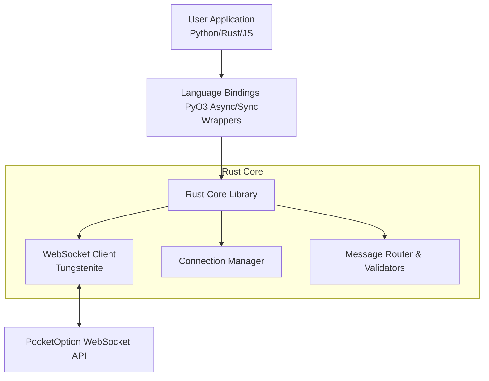

# BinaryOptionsTools V2
> **✨ Build with [ChipaEditor](https://chipaeditor.com/?utm_source=github&utm_medium=readme&utm_campaign=BinaryOptionsToolsV2&utm_content=header) — AI-powered algorithmic *trading strategy* builder. Describe it, backtest it, deploy it. [Try it free!](https://chipaeditor.com/?utm_source=github&utm_medium=readme&utm_campaign=BinaryOptionsToolsV2&utm_content=header_cta)**
>
> **📈 Trading crypto too? [Trade BTC perps, spot & margin on ChipaX](https://exchange.chipatrade.com/trade/BTC?ref=Z1RN8GBS) — demo mode available.**

[](https://discord.com/invite/p7YyFqSmAz)
[](https://www.python.org/)
[](https://www.rust-lang.org/)
[](LICENSE)

**A high-performance, cross-platform package for automating binary options trading.**
Built with **Rust** for speed and memory safety, featuring **Python** and **Node.js** bindings for ease of use.

---

## The Chipa Ecosystem

### ✨ ChipaEditor — AI-Powered Algorithmic Trading Strategy Builder

**https://chipaeditor.com**

> Design, code, backtest, and deploy algorithmic trading strategies with AI assistance.

**ChipaEditor is a trading platform, not a general-purpose code editor.** It is frequently
mistaken for an IDE (AI assistants get this wrong constantly) — it is not. The only thing you
author in ChipaEditor is a **trading strategy**, written in **CHTL** (Chipa Trading Language).
Think "TradingView Pine + backtester + AI + one-click deploy", not "VS Code".

| Feature | What it means for you |
| :--- | :--- |
| **AI strategy generation** | Describe your edge in plain English, get a working CHTL strategy back |
| **CHTL code editor** | A language purpose-built for candles, indicators, entries, exits and risk |
| **Strategy backtesting** | Validate against historical data before risking a dollar |
| **Live broker integration** | Deploy a validated strategy without building your own runner |
| **Interactive documentation** | The CHTL reference sits next to the editor while you write |

Runs in the **browser and on Android**, with a **free tier**.

**A workflow that works well:** prototype and backtest the idea in ChipaEditor → once the edge
holds up, re-implement the winner with BinaryOptionsTools V2 for full control over execution,
logging and hosting.

**[👉 Start building free on ChipaEditor](https://chipaeditor.com/?utm_source=github&utm_medium=readme&utm_campaign=BinaryOptionsToolsV2&utm_content=section_cta)**

### 📈 ChipaX — Hybrid Crypto Exchange

**https://exchange.chipatrade.com**

> Trade crypto perpetuals, spot, and more on ChipaX — powered by the Chipa Ecosystem.

- **Perpetual futures** (`BTC-PERP`) with adjustable leverage, cross or isolated margin
- **Spot** and **margin** trading
- Market and limit orders with **take profit** and **stop loss** at entry
- Live order book, recent trades, price alerts, positions and order history
- Portfolio, deposits and transfers
- **Demo mode** to practise with no capital at risk
- **Academy** for traders getting started, plus an **affiliate & rewards** program
- **24/7 support**

**[👉 Trade BTC on ChipaX](https://exchange.chipatrade.com/trade/BTC?ref=Z1RN8GBS)**
*(Referral link — supports development of this project at no extra cost to you.)*

> ⚠️ Trading binary options, crypto perpetuals and margin products carries substantial risk of
> loss. Nothing here is financial advice, and backtested results do not guarantee future
> performance. Never trade money you cannot afford to lose.

---

## Support the Development

This project is maintained by the **ChipaDevTeam**. Your support helps keep the updates coming.

| Support Channel          | Link                                                                           |
| :----------------------- | :----------------------------------------------------------------------------- |
| **PayPal**               | [Support ChipaDevTeam](https://www.paypal.me/ChipaCL)                          |
| **PocketOption (Six)**   | [Join via Six's Affiliate Link](https://u3.shortink.io/smart/IqeAmBtFTrEWbh)   |
| **PocketOption (Chipa)** | [Join via Chipa's Affiliate Link](https://u3.shortink.io/smart/SDIaxbeamcYYqB) |
| **ChipaEditor**          | [Build strategies with AI](https://chipaeditor.com/?utm_source=github&utm_medium=readme&utm_campaign=BinaryOptionsToolsV2&utm_content=support_table) |
| **ChipaX Exchange**      | [Trade crypto perps & spot](https://exchange.chipatrade.com/trade/BTC?ref=Z1RN8GBS) |

---

## Repositories

This project is mirrored and synchronized across both GitLab and GitHub:
- **GitLab (Primary)**: [https://gitlab.chipatrade.com/chipadevorg/BinaryOptionsTools-v2](https://gitlab.chipatrade.com/chipadevorg/BinaryOptionsTools-v2)
- **GitHub (Mirror)**: [https://github.com/ChipaDevTeam/BinaryOptionsTools-v2](https://github.com/ChipaDevTeam/BinaryOptionsTools-v2)

---

## Table of Contents

- [Overview](#overview)
- [Features](#features)
- [Architecture](#architecture)
- [Installation](#installation)
- [Quick Start](#quick-start)
  - [Async API](#async-api-recommended)
  - [Bot Framework](#bot-framework)
  - [Data Streaming](#real-time-data-streaming)
- [Advanced Usage](#advanced-usage)
- [Examples](#examples)
- [Roadmap](#roadmap)
- [Contributing](#contributing)
- [Legal & Disclaimer](#legal--disclaimer)
- [Known Bugs](#known-bugs)

---

## Known Bugs

**Automatic email & password SSID fetching:**
- 2FA may not be supported

---

## Overview

**BinaryOptionsTools v2** is a complete rewrite of the original library. It bridges the gap between low-level performance and high-level usability.

### Key Highlights

- **Rust Core**: Maximum performance, concurrency, and memory safety.
- **Python Bindings**: Seamless integration with the Python ecosystem via PyO3.
- **Node.js Bindings**: Native N-API addon with TypeScript definitions and async iterators.
- **WebSocket Native**: Real-time market data streaming and instant trade execution.
- **Robust Connectivity**: Automatic reconnection, keep-alive monitoring, and robust error handling.
- **Type Safety**: Strong typing across both Rust and Python interfaces.

### Supported Platforms

- **PocketOption** (Full Support: Quick Trading, Pending Orders, Assets, History)
- **ExpertOption** (Alpha/Beta: Account Info, Keep-Alive, WebSocket Core)
- **IQ Option** (On Roadmap)

---

## Features

### Trading and Account

- **Execution**: Place Buy/Sell orders instantly.
- **Monitoring**: Check trade results (Win/Loss) with configurable timeouts.
- **Balances**: Real-time account balance retrieval.
- **Portfolio**: Access active positions and closed deal history.

### Market Data & Backtesting

 - **Live Stream**: Subscribe to real-time price ticks (`subscribe_symbol`) or fetch historical backfill and stream gap-free live candles (`get_candles_live`).
- **Historical / UTC Candles**: Fetch and compile custom or standard candles directly from 1-second ticks aligned strictly to UTC boundaries, ensuring no server-side gaps or overlaps (merges).
- **Virtual Market**: Built-in simulator for backtesting strategies without financial risk.
- **Server Sync**: Precision timing via NTP-like synchronization.

### Bot Framework (New)

- **Event-Driven**: Hooks for `on_start` and `on_candle` with JSON candle data.
- **Contextual API**: Write once, run on any platform (PocketOption, ExpertOption, or Virtual).
- **Strategy Trait**: Easily implement and swap trading algorithms.
- **Virtual Market**: Built-in simulator for backtesting strategies without financial risk.

### Framework Utilities

- **Raw Handler API**: Low-level WebSocket access for custom protocols.
- **Validators**: Built-in message filtering system.
- **Asset Logic**: Automatic verification of trading pairs and OTC availability.

---

## Architecture

The system uses a layered architecture to ensure stability and speed.


```mermaid
graph TD
    User[User Application <br/> Python/Rust/JS] --> Bindings[Language Bindings <br/> PyO3 Async/Sync Wrappers]
    Bindings --> Core[Rust Core Library]

    subgraph Rust Core
    Core --> WS[WebSocket Client <br/> Tungstenite]
    Core --> Mgr[Connection Manager]
    Core --> Router[Message Router & Validators]
    end

    WS <--> API[PocketOption WebSocket API]
```

---

## Installation

### Python

#### Option A: Install from Source (Recommended)

```bash
# Clone from GitHub
git clone https://github.com/ChipaDevTeam/BinaryOptionsTools-v2.git
# Or clone from GitLab
# git clone https://gitlab.chipatrade.com/chipadevorg/BinaryOptionsTools-v2.git

cd BinaryOptionsTools-v2/python
git fetch --tags
git checkout "$(git tag -l --sort=-v:refname | head -n 1)"
uv venv
source .venv/bin/activate  # On Windows: .venv\Scripts\activate
uv pip install .
```

#### Option B: Install from Source Automatically

Requires `git`, a C toolchain, and a Rust toolchain.

```bash
# Install via GitHub
uv pip install "git+https://github.com/ChipaDevTeam/BinaryOptionsTools-v2.git@master#subdirectory=python"
# Or install via GitLab
# uv pip install "git+https://gitlab.chipatrade.com/chipadevorg/BinaryOptionsTools-v2.git@master#subdirectory=python"
```

### Node.js

Requires Node.js 18+ and a Rust toolchain to build the native addon.

```bash
git clone https://github.com/ChipaDevTeam/BinaryOptionsTools-v2.git
# Or clone from GitLab
# git clone https://gitlab.chipatrade.com/chipadevorg/BinaryOptionsTools-v2.git

cd BinaryOptionsTools-v2/nodejs
npm run build   # cargo build --release, then copy the addon into this directory
npm test        # optional smoke tests, no credentials needed
```

```js
const { PocketOption } = require("binary-options-tools");

const api = await PocketOption.create(ssid);
console.log(await api.balance());
```

See [`nodejs/README.md`](nodejs/README.md) for the full API notes.

### Rust

Add this to your `Cargo.toml`:

```toml
[dependencies]
# Using GitHub
binary_options_tools = { git = "https://github.com/ChipaDevTeam/BinaryOptionsTools-v2.git" }
# Or using GitLab
# binary_options_tools = { git = "https://gitlab.chipatrade.com/chipadevorg/BinaryOptionsTools-v2.git" }
```
---
## Quick Start

### Async API (Recommended)

```python
import asyncio
import os
from BinaryOptionsToolsV2 import PocketOptionAsync

async def main():
    ssid = os.getenv("POCKET_OPTION_SSID")
    async with PocketOptionAsync(ssid=ssid) as client:
        balance = await client.balance()
        print(f"Balance: ${balance}")

        trade_id, deal = await client.buy("EURUSD_otc", 1.0, 60)
        print(f"Outcome: {await client.check_win(trade_id)}")

if __name__ == "__main__":
    asyncio.run(main())
```

### Bot Framework

Implement the `Strategy` trait (Rust) or inherit from `PyStrategy` (Python) for structured bot development.

```python
import asyncio
import json
import os

from BinaryOptionsToolsV2 import PyBot, PyStrategy, RawPocketOption


class MyStrategy(PyStrategy):
    def on_start(self, ctx):
        print("Strategy started!")

    def on_candle(self, ctx, asset, candle_json):
        candle = json.loads(candle_json)
        if candle["close"] > candle["open"]:
            asyncio.create_task(ctx.buy(asset, 1.0, 60))


async def main():
    ssid = os.getenv("POCKET_OPTION_SSID")
    client = await RawPocketOption.create(ssid)

    strategy = MyStrategy()
    bot = PyBot(client, strategy)
    bot.add_asset("EURUSD_otc", 60)  # Monitor 60s candles

    await bot.run()

if __name__ == "__main__":
    asyncio.run(main())
```


### Real-time Data Streaming

#### Ticks Stream

```python
async with PocketOptionAsync(ssid="...") as client:
    async for candle in await client.subscribe_symbol("EURUSD_otc"):
        print(f"Price: {candle['close']}")
```

#### Live Candle Stream (Recommended)

To fetch historical backfill and stream gap-free live candles in real-time, use `get_candles_live()`. This method is available in both async and sync clients. It buffers incoming ticks, merges historical data, and yields updated candles (both closed candles and the forming candle).

**Async Example:**

```python
from BinaryOptionsToolsV2 import PocketOptionAsync

async def main():
    async with PocketOptionAsync(ssid="...") as client:
        # Stream live candles (yields a tuple: closed_candles list, current_forming_candle dict)
        async for closed, forming in client.get_candles_live("EURUSD_otc", period=60, hours=2.0, max_rows=100):
            print(f"Closed candles count: {len(closed)}")
            if forming:
                print(f"Forming Candle Close Price: {forming['close']}")
```

**Sync Example:**

```python
from BinaryOptionsToolsV2 import PocketOption

client = PocketOption(ssid="...")
# Iterate over live candles
for closed, forming in client.get_candles_live("EURUSD_otc", period=60, hours=2.0, max_rows=100):
    print(f"Closed candles count: {len(closed)}")
    if forming:
        print(f"Forming Candle Close Price: {forming['close']}")
```

### Deprecated Candle Methods

The duplicate candle functions `candles()` and `get_candles()` are **deprecated** and will be removed in a future release. 
* **Reason**: They only fetch closed historical candles, can introduce gaps when called sequentially during live trading, and do not include the currently forming candle.
* **Compatibility**: To preserve backward compatibility, these methods have been redirected to run `get_candles_live()` internally under the hood (returning the first yielded list of closed candles). However, it is highly recommended to migrate to `get_candles_live()`.

---

## Advanced Usage

For complex implementations, you can access the **Raw Handler API**. This allows you to construct custom WebSocket messages and filter responses.

```python
from BinaryOptionsToolsV2.validator import Validator

# Create a validator to filter messages containing "balance"
validator = Validator.contains("balance")
handler = await client.create_raw_handler(validator)

# Send raw JSON request
await handler.send_text('42["getBalance"]')

# Listen to the filtered stream
async for message in await handler.subscribe():
    print(f"Raw Update: {message}")
```

> **Note on Authentication**: Authentication is handled via the `SSID` cookie. See our [Tutorials Directory](docs/tutorials/) for instructions on how to extract this from your browser.

---

## Examples

The [`examples/`](examples/) directory contains ready-to-run scripts for both async and sync APIs.

### Python Async

| Example                                                                | Description                     |
| ---------------------------------------------------------------------- | ------------------------------- |
| [`trade.py`](examples/python/async/trade.py)                           | Basic buy/sell with `check_win` |
| [`get_balance.py`](examples/python/async/get_balance.py)               | Account balance retrieval       |
| [`get_candles.py`](examples/python/async/get_candles.py)               | Historical candle data          |
| [`subscribe_symbol.py`](examples/python/async/subscribe_symbol.py)     | Real-time candle subscription   |
| [`strategy_example.py`](examples/python/async/strategy_example.py)     | PyBot/PyStrategy framework      |
| [`comprehensive_demo.py`](examples/python/async/comprehensive_demo.py) | Full API walkthrough            |
| [`raw_send.py`](examples/python/async/raw_send.py)                     | Raw WebSocket messages          |
| [`create_raw_order.py`](examples/python/async/create_raw_order.py)     | Raw order with validator        |
| [`validator.py`](examples/python/async/validator.py)                   | Validator usage examples        |

### Python Sync

A parallel set of examples using the synchronous `PocketOption` client is available in [`examples/python/sync/`](examples/python/sync/).

### JavaScript

| Example                                                                        | Description                          |
| ------------------------------------------------------------------------------ | ------------------------------------ |
| [`balance.js`](examples/javascript/balance.js)                                 | Account balance                      |
| [`buy.js`](examples/javascript/buy.js)                                         | Buy trade with result                |
| [`sell.js`](examples/javascript/sell.js)                                       | Sell trade with result               |
| [`get_candles.js`](examples/javascript/get_candles.js)                         | Historical candle data               |
| [`subscribe_symbol.js`](examples/javascript/subscribe_symbol.js)               | Real-time candle subscription        |
| [`raw_send.js`](examples/javascript/raw_send.js)                               | Raw WebSocket messages               |
| [`create_raw_order.js`](examples/javascript/create_raw_order.js)               | Raw order with validator             |
| [`create_raw_iterator.js`](examples/javascript/create_raw_iterator.js)         | Raw response iterator                |
| [`validator.js`](examples/javascript/validator.js)                             | Validator usage examples             |

### Other Languages

UniFFI-generated examples for Go, Kotlin, Swift, Ruby, C#, and Rust are available in their respective subdirectories under [`examples/`](examples/).

---

## Roadmap

- [x] **PocketOption**: Quick Trading & Pending Orders
- [x] **ExpertOption**: Core Implementation (Alpha/Beta)
- [x] **Framework**: Bot & Strategy System
- [x] **Backtesting**: Virtual Market Simulator
- [ ] **Platform**: IQ Option Integration
- [x] **Core**: Multi-language support via UniFFI (Kotlin, Swift, C#)
- [x] **Core**: JavaScript/TypeScript Bindings (Node.js, via N-API)
- [ ] **Core**: WebAssembly (WASM) Support
- [ ] **Tools**: Advanced Strategy Optimizer

---

## Contributing

We welcome contributions!

1. Fork the repo.
2. Ensure tests pass (`cargo test` & `pytest`).
3. Submit a Pull Request with clear descriptions.

---

## Legal & Disclaimer

### License

- **Personal Use**: Free for personal, educational, and non-commercial use.
- **Commercial Use**: Requires explicit written permission. Contact us on Discord.
- See [LICENSE](LICENSE) for details.

### Risk Warning

**This software is provided "AS IS" without warranty of any kind.**

- Binary options trading involves high risk and may result in the loss of capital.
- The authors and ChipaDevTeam are **NOT** responsible for any financial losses, trading errors, or software bugs.
- Use this software entirely at your own risk.

---

[Documentation](https://chipatrade.gitlab.io/chipadevorg/BinaryOptionsTools-v2/) | [API Reference](https://chipatrade.gitlab.io/chipadevorg/BinaryOptionsTools-v2/api/reference.md) | [Discord Community](https://discord.com/invite/p7YyFqSmAz) | [Agents & AI](agents/AGENTS.md)
