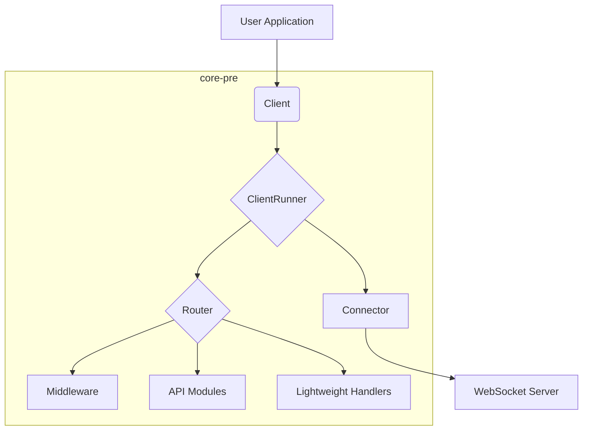
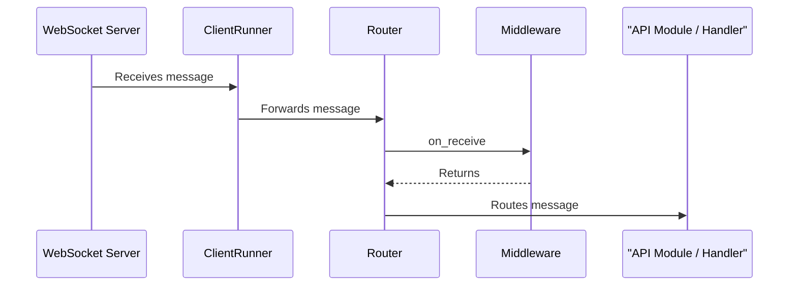
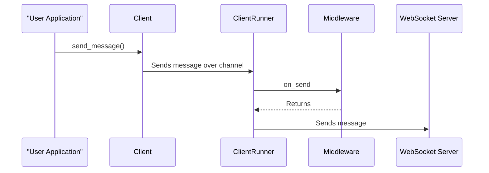

+++
title = "Core-Pre Architecture"
description = "A deep dive into the core architecture of the `core-pre` crate."
weight = 1
+++

# Core-Pre Architecture

Welcome to the documentation for the `core-pre` crate. This document provides a detailed explanation of the internal architecture of the crate, how data flows through the system, and the design principles behind it.

## High-Level Overview

The `core-pre` crate is designed to be a flexible and extensible foundation for building WebSocket clients. It is built around a few key components that work together to manage the connection, process messages, and handle application logic.

Here is a high-level diagram of the architecture:

## Core Components

Let's take a closer look at each of the core components.

### `Client`

The `Client` is the public-facing handle that your application will use to interact with the WebSocket connection. It provides a simple and safe API for sending messages, checking the connection status, and accessing the handles of registered API modules.

The `Client` is designed to be cloneable, so you can easily share it across multiple tasks or threads in your application.

### `ClientRunner`

The `ClientRunner` is the heart of the `core-pre` crate. It is a background task that is responsible for managing the entire lifecycle of the WebSocket connection. Its key responsibilities include:

- **Connecting and Reconnecting**: The `ClientRunner` uses a `Connector` to establish a connection to the WebSocket server. If the connection is lost, it will automatically try to reconnect.
- **Message Loops**: It spawns two tasks: a reader task to handle incoming messages and a writer task to handle outgoing messages.
- **Command Handling**: It listens for commands from the `Client` handle, such as `disconnect` and `shutdown`.
- **State Management**: It manages the connection state (connected, disconnected) and notifies the rest of the application of any changes.

### `Router`

The `Router` is responsible for dispatching incoming messages to the correct handlers. When the `ClientRunner`'s reader task receives a message, it forwards it to the `Router`. The `Router` then goes through a list of rules to determine which module or lightweight handler should receive the message.

This rule-based approach makes the system very flexible, as you can easily define custom routing logic for different types of messages.

### `Connector`

The `Connector` is a trait that abstracts the process of establishing a WebSocket connection. This allows you to provide your own custom connection logic if needed. For example, you might need to perform a special handshake with the server or handle a proxy.

The `core-pre` crate provides a default `Connector` implementation that should be sufficient for most use cases.

### `Middleware`

The `Middleware` system allows you to hook into the connection lifecycle and message processing pipeline. You can use middleware to implement cross-cutting concerns such as logging, statistics, or message transformation.

Middleware can be registered with the `ClientBuilder` and will be executed at key points, such as:

- `on_connect`
- `on_disconnect`
- `on_receive`
- `on_send`

## Modules and Handlers

The application logic in a `core-pre` based client is organized into modules and lightweight handlers.

- **API Modules**: These are long-running tasks that have their own state and can handle a specific set of messages. They are useful for implementing complex features that require state to be maintained across multiple messages.
- **Lightweight Handlers**: These are simple functions that are executed for every incoming message. They are useful for simple, stateless operations like logging or metrics.

## Data Flow

The following diagram illustrates the flow of data through the system.

### Incoming Messages

### Outgoing Messages

