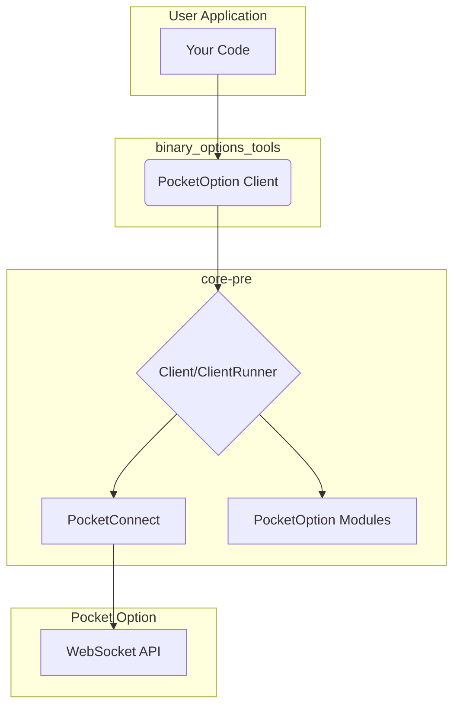

+++
title = "PocketOption Client"
description = "Documentation for the PocketOption client and its integration with `core-pre`."
weight = 2
+++

# PocketOption Client

This document explains how the `PocketOption` client is implemented on top of the `core-pre` crate. It will cover the specific modules used, the custom `Connector` and `State` implementations, and how to use the client.

## Architecture Overview

The `PocketOption` client is a concrete implementation of a `core-pre` based client. It uses the building blocks provided by `core-pre` to create a high-level API for interacting with the Pocket Option platform.

Here is a diagram showing the architecture:

## Key Components

### `PocketOption` Struct

This is the main entry point for using the client. It provides high-level methods for performing actions like trading, checking the balance, and subscribing to asset prices. Internally, it holds a `Client<State>` from `core-pre` and uses it to communicate with the `ClientRunner`.

### `PocketConnect` Connector

This is a custom `Connector` implementation for the Pocket Option API. It is responsible for handling the specific connection logic required by Pocket Option, such as the initial handshake and authentication.

### `State` Struct

The `State` struct holds all the application state that is specific to the Pocket Option client. This includes:

- The user's session ID (`ssid`).
- The current balance.
- The list of available assets.
- The server time.

This state is shared between all the modules and can be accessed via the `Client` handle.

### Modules

The `PocketOption` client is built from a collection of specialized modules, each responsible for a specific part of the Pocket Option API. Here are some of the key modules:

- **`KeepAliveModule`**: Responds to the server's ping messages to keep the connection alive.
- **`BalanceModule`**: Handles updates to the user's balance.
- **`AssetsModule`**: Fetches and manages the list of available assets.
- **`TradesApiModule`**: Handles the logic for placing trades.
- **`DealsApiModule`**: Checks the results of completed trades.
- **`SubscriptionsApiModule`**: Manages subscriptions to real-time asset price updates.
- **`GetCandlesApiModule`**: Fetches historical candle data.
