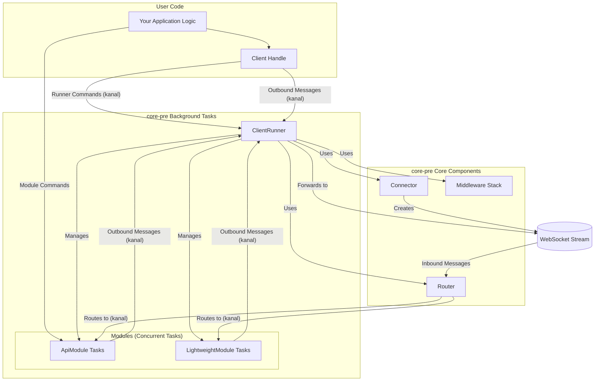
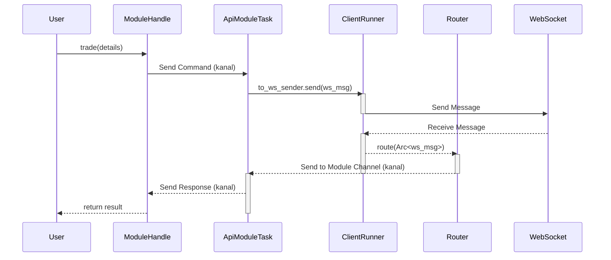

# `binary-options-tools-core-pre` Crate Documentation

This document provides a comprehensive overview of the `binary-options-tools-core-pre` crate, its architecture, performance characteristics, and best practices for its use.

## 1. Architecture Overview

The `core-pre` crate is designed as a generic, modular, and high-performance engine for building WebSocket clients. It is architected to be completely agnostic of the specific application logic, providing a robust framework for handling WebSocket connections, message routing, and concurrency.

### Core Components

*   **`Client<S>`**: The public-facing handle that application code uses to interact with the WebSocket connection. It provides methods for sending messages, managing the connection state (disconnect, reconnect, shutdown), and accessing handles to registered `ApiModule`s. It is lightweight, clonable, and communicates with the `ClientRunner` via asynchronous channels.

*   **`ClientRunner<S>`**: The heart of the client. This is a background task that manages the entire lifecycle of the WebSocket connection. It is responsible for:
    *   Establishing the initial connection and handling reconnections using a `Connector`.
    *   Spawning and managing the WebSocket reader and writer tasks.
    *   Receiving commands from the `Client` handle (e.g., `Shutdown`, `Disconnect`).
    *   Passing incoming messages to the `Router`.

*   **`Router<S>`**: Responsible for routing incoming WebSocket messages to the correct modules. When the `ClientRunner` receives a message, it passes it to the `Router`, which then iterates through the rules of registered modules to determine where to send the message.

*   **`Connector<S>`**: A trait that defines the logic for establishing a WebSocket connection. Concrete implementations of this trait handle the specifics of the connection handshake for a particular server.

### Modularity

The crate is designed to be highly modular, allowing application logic to be broken down into self-contained, concurrent units called "modules."

*   **`AppState`**: A trait representing the shared state of the application. An `Arc<S>` where `S: AppState` is shared among the client, all modules, and middleware, allowing for safe concurrent access to application-wide data.

*   **`ApiModule<S>`**: A trait for a self-contained, concurrent module that exposes a command-based API. It's designed for request/response patterns. A user interacts with an `ApiModule` through a typed `Handle`, which sends commands to the module's background task and receives responses. Examples in `binary-options-tools` include `TradesApiModule` and `DealsApiModule`.

*   **`LightweightModule<S>`**: A simpler trait for modules that only need to process incoming messages without a command/response API. These are useful for tasks like logging, monitoring, or handling server-pushed data (e.g., `KeepAliveModule`, `BalanceModule` in `binary-options-tools`).

### Architecture Diagram



## 2. Data Flow Analysis

This section details the movement of data through the system for both outgoing and incoming messages. The use of `kanal` channels is central to the design, providing high-performance, MPMC (multi-producer, multi-consumer) communication between tasks.

### Outgoing Message Flow (Client -> Server)

1.  **Initiation**: A user calls a method on an `ApiModule` handle (e.g., `trades_handle.trade(...)`) or directly on the `Client` (e.g., `client.send_text(...)`).
2.  **Command Channel (for Modules)**: The module handle sends a command object encapsulating the request to the `ApiModule`'s background task via a dedicated `kanal` channel.
3.  **Message Creation**: The module task receives the command, processes it, and constructs a `tokio_tungstenite::tungstenite::Message`.
4.  **WebSocket Send Channel**: The module sends the `Message` to the `ClientRunner`'s writer task via the shared `to_ws_sender` channel.
5.  **Middleware Hook**: The `ClientRunner`'s writer task receives the message and calls the `on_send` hook on any registered middleware.
6.  **Send to Server**: The writer task sends the message to the WebSocket server over the TCP stream.

### Incoming Message Flow (Server -> Client)

1.  **Message Reception**: The `ClientRunner`'s reader task receives a `Message` from the WebSocket server.
2.  **Message Wrapping**: The message is wrapped in an `Arc<Message>` to allow for cheap cloning and sharing between multiple potential consumers without copying the underlying data.
3.  **Routing**: The reader task passes the `Arc<Message>` to the `Router`.
4.  **Middleware Hook**: The `Router` first calls the `on_receive` hook on any registered middleware.
5.  **Rule-Based Routing**: The `Router` then iterates through the rules of all registered `LightweightModule`s and `ApiModule`s.
6.  **Message Dispatch**: If a module's rule returns `true`, a clone of the `Arc<Message>` is sent to that module's dedicated `kanal` channel for processing.
7.  **Module Processing**: The module's background task receives the message, deserializes it, and acts on it (e.g., updates state, sends a response to a waiting handle).

### Sequence Diagram



## 3. Performance Analysis and Optimizations

This section identifies potential performance bottlenecks in the `core-pre` crate and its common usage patterns (as seen in `binary-options-tools`). It also provides concrete suggestions for optimization.

### Bottleneck 1: Message Routing

**Analysis**: The current `Router::route` method iterates through a `Vec` of module rules for every incoming message. This is an O(N) operation, where N is the number of modules. For applications with many modules and a high message rate, this linear scan can become a significant CPU bottleneck.

**Optimization**: Replace the `Vec`-based iteration with a more efficient lookup mechanism. A `HashMap` is a good general-purpose choice if rules can be mapped to a key. For example, if messages have a "type" or "subject" field, you can use that as a key to directly look up the corresponding module's sender channel.

**Example**:

Let's assume incoming messages are JSON with a `type` field, like `{"type": "candles", "data": ...}`.

**Before (in `Router::route`)**:
```rust
// In Router::route
for (rule, sender) in &self.module_rules {
    if rule.call(&message) {
        // ... send message
    }
}
```

**After (conceptual change)**:

First, change the `Router` to use a `HashMap`.

```rust
// In `Router` struct
use std::collections::HashMap;
pub(crate) module_rules: HashMap<String, AsyncSender<Arc<Message>>>;

// When adding a module, instead of pushing to a Vec, insert into the map
// based on the message type the module handles.
```

Then, update the routing logic.

```rust
// In Router::route
if let Ok(text) = message.to_text() {
    if let Ok(json) = serde_json::from_str::<serde_json::Value>(text) {
        if let Some(msg_type) = json.get("type").and_then(|v| v.as_str()) {
            if let Some(sender) = self.module_rules.get(msg_type) {
                if sender.send(message.clone()).await.is_err() {
                    // ... handle error
                }
                return Ok(()); // Message routed, no need to check other rules
            }
        }
    }
}
// Fallback for non-keyed messages or further processing
// ...
```
**Note**: This requires a convention for message formats. If messages are not easily keyable, other strategies like grouping rules by message content (e.g., binary vs. text) can still help reduce the number of checks per message.

### Bottleneck 2: Serialization

**Analysis**: The `binary-options-tools` crate uses `serde_json` for WebSocket messages. For the very large messages (20KB+) and high volume of small messages mentioned by the user, JSON deserialization can be a major CPU bottleneck. Furthermore, the `pocketoption` implementation uses `php_serde` to parse the `ssid`, which is highly inefficient and not standard for high-performance systems.

**Optimization**:
1.  **Faster JSON**: Replace the standard `serde_json` with a faster alternative like `simd-json` or `serde_json::from_slice`. `simd-json` can provide a significant performance boost for JSON parsing.
2.  **Binary Formats**: For performance-critical applications, switch to a binary serialization format like MessagePack (`rmp-serde`) or Bincode. These are typically much faster and produce smaller payloads than JSON.
3.  **Avoid `php_serde`**: The PHP serialization format is text-based, inefficient, and insecure. The reliance on it in `pocketoption` for parsing the session ID is a major liability. The data should be extracted using string manipulation or regular expressions instead of a full-blown deserializer.

**Example (using `simd-json`)**:

To use `simd-json`, you would typically read the message into a mutable byte slice and parse in place.

```rust
// In a module's message processing loop
use simd_json;

let msg_bytes = message.as_ref(); // Get message as &[u8]
if let Message::Text(text) = msg_bytes {
    let mut bytes = text.as_bytes().to_vec(); // SIMD JSON needs mutable bytes
    match simd_json::from_slice(&mut bytes) {
        Ok(value) => { /* process value */ },
        Err(e) => { /* handle error */ }
    }
}
```

### Bottleneck 3: Middleware Overhead

**Analysis**: The middleware stack is called for every message sent and received (`on_send`, `on_receive`). If the middleware performs heavy computations or I/O, it will slow down the entire message pipeline. The `TestingWrapper` for statistics is a prime example. Updating and logging stats for every single message can create significant overhead.

**Optimization**:
*   **Batching**: Instead of processing on every message, batch operations in the middleware. For statistics, accumulate counts in memory and log/process them on a timer (e.g., every 1 second).
*   **Asynchronous Processing**: If a middleware needs to perform I/O (like writing to a file or database), it should do so asynchronously in a separate task to avoid blocking the message flow.

**Example (Batching Statistics)**:

Instead of having the `on_receive` hook in the stats middleware do heavy work, have it just increment an atomic counter. A separate background task can then periodically read the counter and update the full stats structure.

```rust
// In the statistics middleware
struct StatsMiddleware {
    received_count: Arc<AtomicU64>,
    // ... other stats
}

impl Middleware<S> for StatsMiddleware {
    async fn on_receive(&self, _msg: &Message, _ctx: &MiddlewareContext<S>) {
        self.received_count.fetch_add(1, Ordering::Relaxed);
    }
}

// In a separate task spawned when the middleware is created:
tokio::spawn(async move {
    loop {
        tokio::time::sleep(Duration::from_secs(1)).await;
        let count = received_count.swap(0, Ordering::Relaxed);
        // Now update the main stats structure with the count for the last second
    }
});
```

### Bottleneck 4: Memory Usage

**Analysis**: The use of `Arc<Message>` is excellent for preventing data copies. However, memory can still grow if not managed carefully. The `ConnectionStats` struct in the `TestingWrapper` contains a `connection_history: Vec<ConnectionEvent>`. If this vector is unbounded, it will grow indefinitely over the lifetime of the client, leading to high memory consumption.

**Optimization**: Use a bounded collection, like a `VecDeque`, to store recent events. This acts as a ring buffer, automatically discarding old events as new ones are added.

**Example**:

**Before (in `ConnectionStats`)**:
```rust
// In testing::statistics.rs
pub struct ConnectionStats {
    // ...
    pub connection_history: Vec<ConnectionEvent>,
}
```

**After (conceptual change)**:
```rust
// In testing::statistics.rs
use std::collections::VecDeque;

const MAX_HISTORY_EVENTS: usize = 100;

pub struct ConnectionStats {
    // ...
    pub connection_history: VecDeque<ConnectionEvent>,
}

// When adding an event:
fn add_event(stats: &mut ConnectionStats, event: ConnectionEvent) {
    if stats.connection_history.len() == MAX_HISTORY_EVENTS {
        stats.connection_history.pop_front(); // Remove the oldest event
    }
    stats.connection_history.push_back(event);
}
```

## 4. Error Handling

This section reviews the error handling strategy and suggests improvements to make the crate more robust and easier to debug.

### Current Error Handling

The crate uses the `thiserror` library to define custom error types, which is a good practice. However, the connection logic in `ClientRunner` uses a simple fixed-delay retry mechanism.

```rust
// In ClientRunner::run
warn!(target: "Runner", "Connection failed: {e}. Retrying in 5s...");
tokio::time::sleep(std::time::Duration::from_secs(5)).await;
```

### Improvement 1: Exponential Backoff for Reconnections

A fixed 5-second retry delay is not ideal. If the server is down, this can lead to a "thundering herd" problem. A better approach is to use an exponential backoff strategy, which increases the delay after each failed attempt.

**Recommendation**: Use a crate like `backoff` to implement a robust reconnection strategy.

**Example**:

```rust
// In ClientRunner::run
use backoff::{ExponentialBackoff, future::retry};

let connect_with_backoff = || async {
    self.connector.connect(self.state.clone()).await.map_err(backoff::Error::transient)
};

let ws_stream = match retry(ExponentialBackoff::default(), connect_with_backoff).await {
    Ok(stream) => stream,
    Err(e) => {
        error!(target: "Runner", "Connection failed after multiple retries: {e}. Shutting down.");
        self.shutdown_requested = true;
        return;
    }
};
```

### Improvement 2: Enriching Error Context

Errors returned from modules or the core client can sometimes lack context, making debugging difficult.

**Recommendation**: Use the `#[error(transparent)]` and `#[from]` attributes from `thiserror` to build up a chain of errors, and add more contextual information at each layer.

**Example**:

```rust
// In pocketoption::error.rs
use binary_options_tools_core_pre::error::CoreError;

#[derive(Debug, thiserror::Error)]
pub enum PocketError {
    #[error("Trade execution failed for asset {asset_id}")]
    TradeFailed {
        asset_id: String,
        #[source]
        source: CoreError,
    },

    #[error(transparent)]
    Core(#[from] CoreError),
    // ... other errors
}

// When returning an error
// Instead of: return Err(core_error.into())
// Do this:
return Err(PocketError::TradeFailed {
    asset_id: "EURUSD".to_string(),
    source: core_error,
});
```

## 5. How This Crate is Used

This `core-pre` crate is not intended to be used directly by end-users. Instead, it serves as a foundational engine for building higher-level client libraries.

The `binary-options-tools` crate is the primary consumer of `core-pre`. It uses the framework as follows:

1.  **Implements the `Connector` trait**: The `pocketoption::connect::PocketConnect` struct implements the `Connector` trait to handle the specific handshake and connection logic for the PocketOption WebSocket server.
2.  **Defines a custom `AppState`**: The `pocketoption::state::State` struct implements the `AppState` trait, holding all the shared data for a PocketOption session, such as the session ID, balance, and available assets.
3.  **Builds Concrete Modules**: It defines numerous `ApiModule`s (e.g., `TradesApiModule`, `DealsApiModule`) and `LightweightModule`s (e.g., `KeepAliveModule`) that contain the specific logic for handling different features of the PocketOption API. Each module defines a `rule` to filter the messages it's interested in.
4.  **Provides a High-Level Client**: The `pocketoption::pocket_client::PocketOption` struct wraps the `core-pre::Client` and provides a user-friendly, high-level API for interacting with the platform (e.g., `trade()`, `get_balance()`, `subscribe_to_candles()`). This hides the underlying module architecture from the end-user.

In essence, `core-pre` provides the generic, reusable "engine" (connection management, routing, concurrency), while `binary-options-tools` provides the specific "vehicle" (the actual implementation for a specific trading platform).
